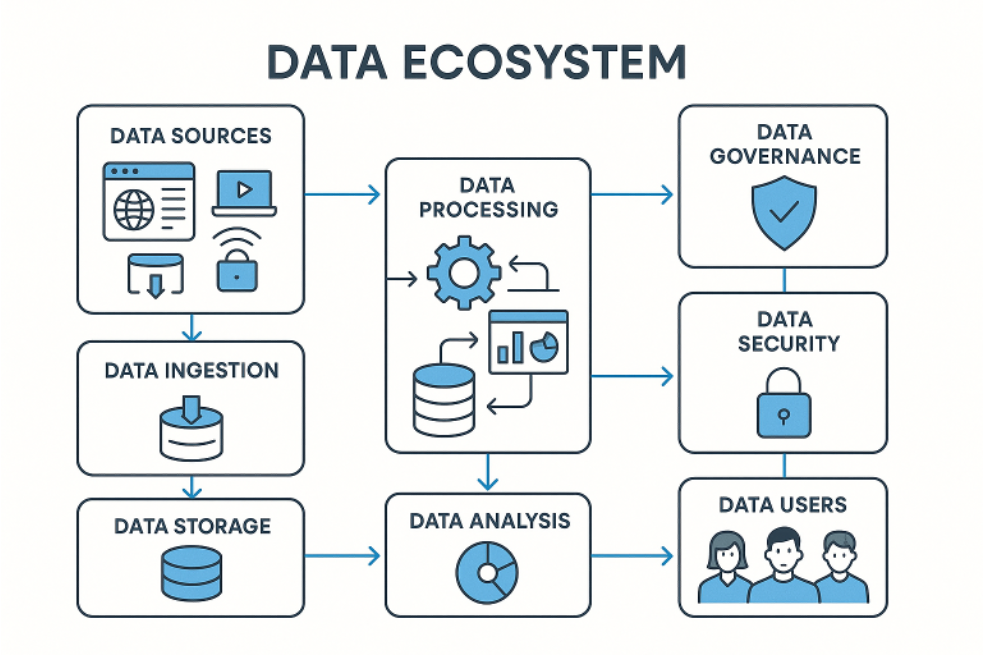

```{r setup, include=FALSE}
knitr::opts_chunk$set(echo = FALSE)
```


## 설치하기

ecoDI 패키지는 [GitHub](https://github.com/)으로부터 다음과 같이 설치합니다.

``` r
# install.packages("devtools")
devtools::install_github("choonghyunryu/ecoDI")
```

### 생태계를 논하다

생물(식물, 동물, 미생물 등)과 비생물적 환경(공기, 물, 온도, 햇빛 등)이 서로 영향을 주고받으며 상호작용하는 역동적인 복합체 

```{r, echo=FALSE, out.width = "85%", fig.align='center', fig.cap="자연의 생태계"}
knitr::include_graphics("img/ecosystem.jpg")
```


### 데이터 생태계

데이터를 생성, 관리, 저장, 분석 및 공유하는 데 관련된 모든 요소와 그들 간의 상호작용을 포괄하는 시스템


```{r, echo=FALSE, out.width = "85%", fig.align='center', fig.cap="데이터 생태계"}

```


### “ecoDI란 무엇인가요?” 

데이터 생성(수집), 관리, 저장, 분석, 공유 기능을 제공하여 DI를 지원하는 생태계를 지향하는 솔루션

```{r, echo=FALSE, out.width = "85%", fig.align='center', fig.cap="ecoDI란 무엇인가요?"}

```


### ecoDI 기능

데이터를 생성, 관리, 저장, 분석 및 공유하는 기능 정의 및 기본 기능의 점차적 구현

```{r, echo=FALSE, out.width = "85%", fig.align='center', fig.cap="ecoDI 기능"}
knitr::include_graphics("img/ecodi_function.png")
```

