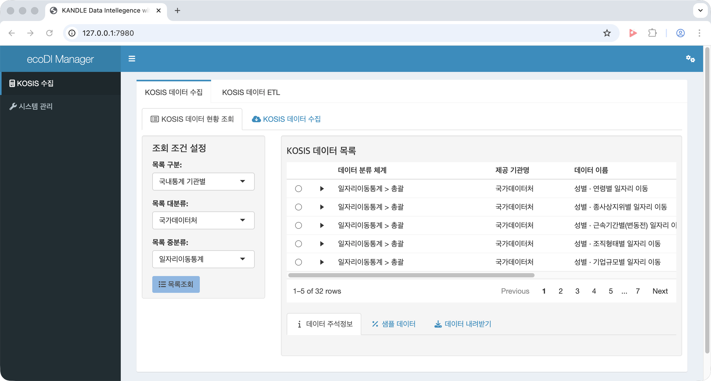

```{r setup, include=FALSE}
knitr::opts_chunk$set(echo = TRUE, 
                      message = FALSE, 
                      warning = FALSE, 
                      collapse = FALSE,
                      fig.align = "center",
                      tidy.opts = list(width.cutoff = 70), 
                      tidy = TRUE)
knitr::opts_chunk$set(fig.width = 12, fig.height = 9)

library(shiny, warn.conflicts = FALSE)
library(dplyr, warn.conflicts = FALSE)
library(ggplot2, warn.conflicts = FALSE)

xaringanExtra :: use_panelset()
```


```{r}
#| intro, 
#| echo=FALSE, 
#| out.width = "45%"

```


```{r, preface, echo=FALSE}
div(class = "preface", 
    h4("들어가기"),
    "Shiny Server 환경이 구성되었다구요?", br(),
    "이제는 ecoDI Manager를 설치할 차례입니다.")
```

<br>


## ecoDI Manager 구조

ecoDI Manager는 shiny 애플리케이션으로 구성되어 있습니다.

2025-02-08 기준으로 애플리케이션은 다음과 같은 구조로 되어 있습니다.

```bash
sh-5.2$ tree ecoDI_manager/
ecoDI_manager/
├── LICENSE
├── R
│   ├── data.R
│   ├── display.R
│   ├── html_css.R
│   └── html_tag.R
├── README.md
├── ecoDI_manager.Rproj
├── global.R
├── logo_kandle.png
├── menu
│   ├── data_ui.R
│   ├── kosis_ui.R
│   └── manage_ui.R
├── modules
│   └── 01_meta_system.R
├── server.R
└── ui.R

3 directories, 17 files
sh-5.2$
```

## ecoDI Manager 다운로드

ecoDI Manager는 다음과 같은 github private repository에 호스팅되어 있습니다.

```bash
https://github.com/choonghyunryu/ecoDI_manager
```

이 저장소를 클론(clone)합니다.

```bash
git clone https://github.com/choonghyunryu/ecoDI_manager.git
```

## ecoDI Manager 설치하기

단지 해팡 파일을 Shiny Server 디렉토리로 복사하는 것으로 설치가 마무리 됩니다.

```bash
sudo cp -rf ~/ecoDI_manager /srv/shiny-server/
```

## ecoDI Manager 실행하기

이미 Shiny Server가 구동 중이라면, 웹 브라우저에서 다음 URL로 접속합니다.

```bash
http://<서버 IP 주소>:3838/ecoDI_manager/
```

AWS 크롤링서버의 퍼블릭 IP 주소를 확인한 후, 웹 브라우저에서 다음 URL로 접속합니다.

```bash
http://3.39.196.148:3838/ecoDI_manager/
```

